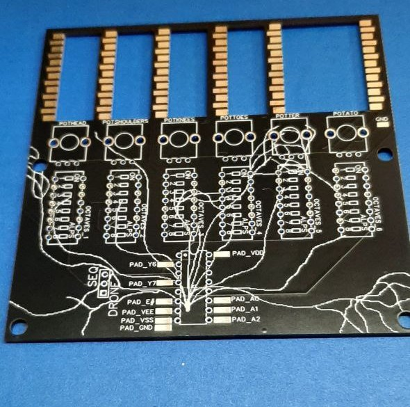
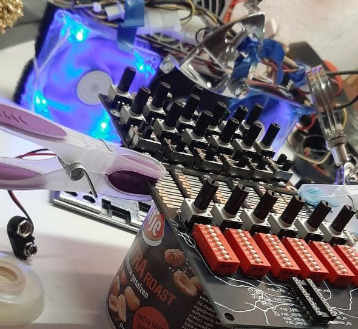
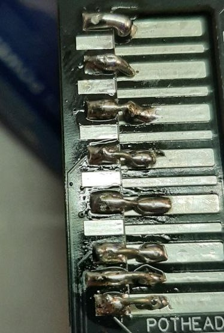
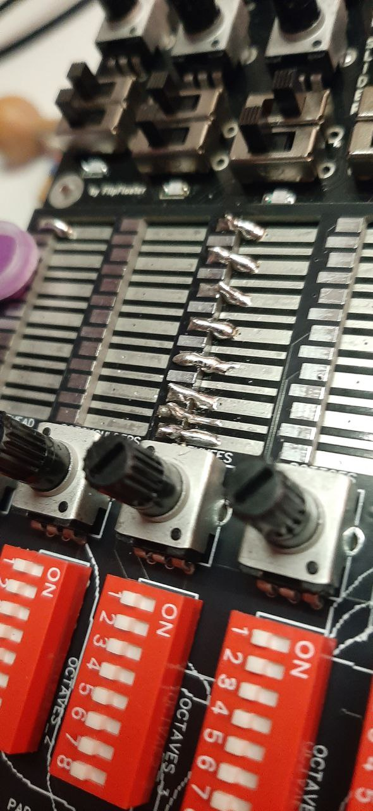
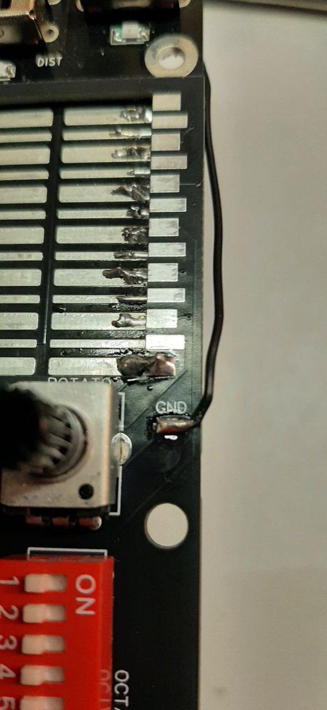
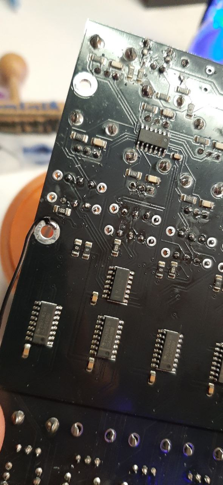
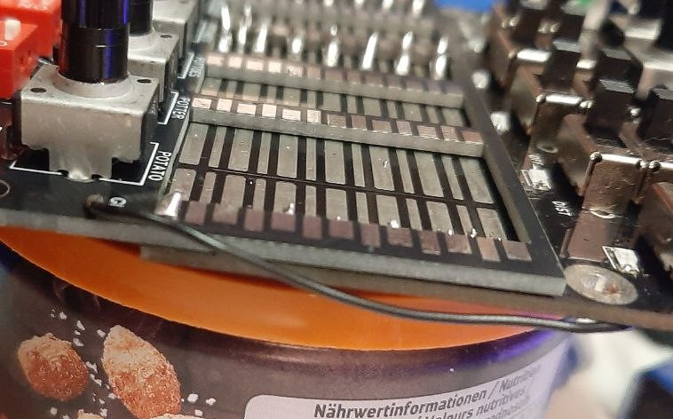
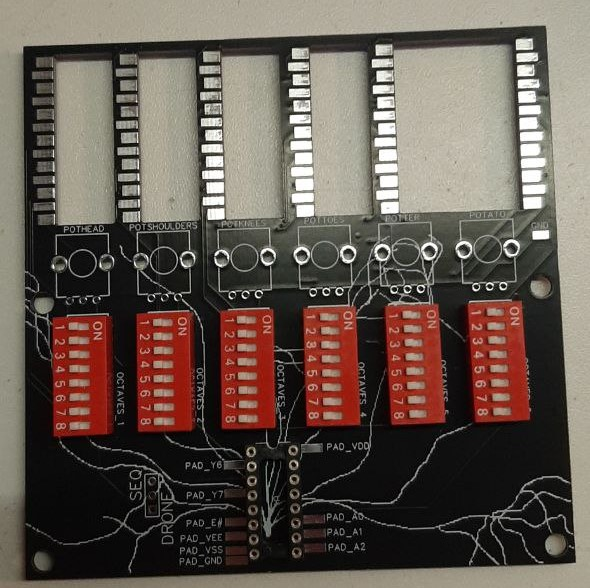
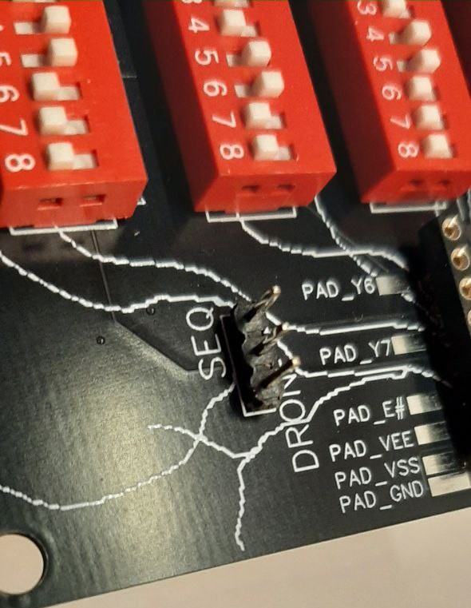
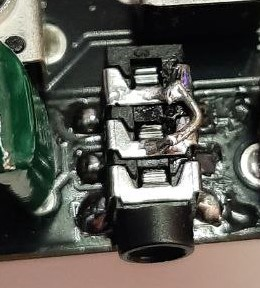

##### Table of Contents  
[About](#About)
[Circuit](#Circuit)
[Design](#Design)
[How it works](#How-it-works)
[Assembly](#Assembly)
[Sequencer](#Sequencer)

# DronesliderSwitches
Addon PCB for FlipFloaters Hex Drone Slider

# About
FlipFloater, great DIY Synth builder (https://flipfloater.net/) created an awesome small DIY Synthesizer. It´s a 6-Tone Touch sensitive drone synth with 7 octaves per tone. The basis are six Schmitt-Triggers (Squarewaves). The pitch of each tone is adjustable and has a 4070 ring modulation and a distortion. Great Kit he offered to build at Circuit Control Festival in Dresden (https://www.circuit-control.de/)
The Synth is great and motivated me to continue building electronic projects. However my brain is never satisfied, so immediately I started thinking about how to mod this beautiful machine and render it possibly even more useful for making Music.
The Idea was, that, like an actual drone synth, you don´t need to play it, instead you can fade in and out each of the 6 Voices. This should make the sounds much more spheric and ambient. With switches I wanted to be able to toggle each of the 7 Voice Octaves. 
As it should be quite an easy project I thought it was time to design this as my first PCB.

# Circuit
The DroneSlider has 6 Pads, one for each Voice. The pads consist of Metal plates, that you touch with your finger. The flowing Electricity enables every Octave: Small pad means +Voltage, Large Pad connects to each octave. the Circuit has Solder Pads, that are soldered onto the Original DroneSlider to connect to. These Pads are then connected again to DIP Switches, with which you can switch every Octave on and off. Between the +Voltage and each "Receiver Pad" I added a Potentiometer, to gradually fade in each voice.
Also added in the Circuit is a CD4051BE Multiplexer, Which could be used to make this thing a 6 step multiplexer! Insane, right?

# Design
The Circuit and PCB were designed using EasyEDA, an online tool to create these things and order them directly for manufacturing. Both export files are in the EasyEDA/ folder in this repo. You can simply import these .JSON files into the EasyEDA designer (free account needed) and modify them as you wish.
At the end, you have to create Gerber files, they contain all the PCB Traces, drill holes, solder pads and writing. These you can then upload to EasyEDA and order them.
If you edit the .JSON files, you need to create the Gerber files again and upload them. Of course, you can use any design tool and PCB manufacturing service you want, as long as the files are compatible.

# How it works

# Assembly
The blank PCB arrived and looked beautiful. Inspect it for errors and admire your work!

Start with attaching the PCBs to each other first. I did the mistake to first populate the PCB with the potentiometers and well, what can I say, I burned them with my solder iron.

1. Align the pins of the addon board with the Main DroneSlider board. Make the lowest Pad match.
   Blue: connect the Thick pads (and the lowest thin pad)
   Red: Don´t connect he other thin pads
   Red dotted: The uppermost thin pad on the main board will not be seen (and not connected)
   

3. Clamp the boards in place so they don´t slip and you can solder in peace. Solder upper left and lower right corner first for stability.

4. Solder the Pads together. This is a Pain I tell you. I first tried to bridge by just using a lot of solder, this worked sometimes but not very convenient and fiddly.
   I then tried to make small wires (2mm or so) and bend them in a 90° angle. Then, using pliers, solder one end to the upper pad first, keep holding the wire and also solder to the lower pad.
   The solder joints look absolutely horrible and I don´t know if the connections are good, but it´s the best I could get to work. For easier installation it´s probably needed to find a different solution for connecting the pads.

   
   

5. Solder a Wire from the GND pad to a GND on the main board. I soldered it to the GND ring on the backside.
   
   
   

6. Solder the parts in, from smallest to tallest. First the IC socket, then the DIP switch and lastly the potentiometers. Always solder one pin, so the part holds in place, then reheat the solder and push it in straight position.
   Then continue to solder all pins. Lastly solder the 3 Pin header in.
   
   

7. Modify the jack socket (optional)
   I found, that I usually only have stereo jack cables laying around. By connecting them to the socket of the droneslider you will only get sound on one channel. To simply "clone" the audio signal to both channels, just add a small bridging wire.
   Be careful to not melt the jack socked, as this would suck.
   

8. Additional tips:
   - Clean the surface with some nail polish or alcohol cleaner, but don´t spill it all over your desk
   - Don´t burn the potentiometers with your solder iron
   - when desoldering your previous modifications, don´t rip off one of the pads like I did
   - It´s a fiddly job, don´t loose patience and take breaks if needed

# Sequencer
